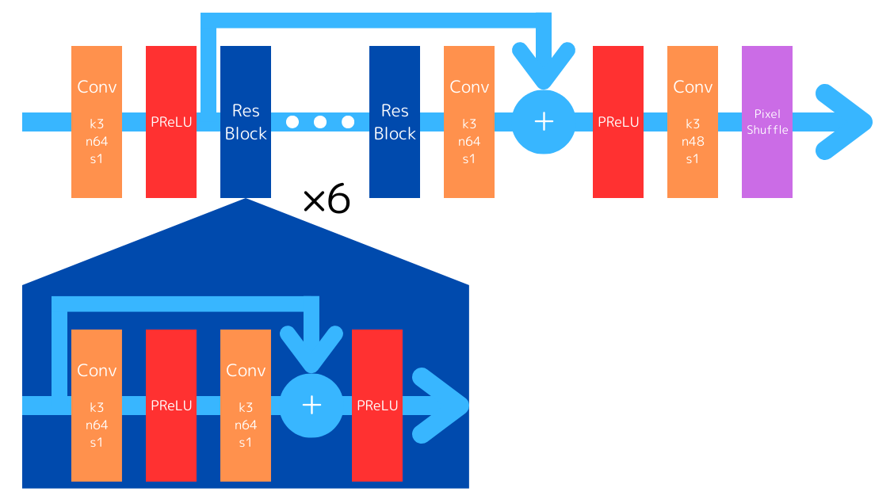

# 概要
Axell AI Contest 2024(https://signate.jp/competitions/1374 )の3位解法。このコンペは4倍超解像モデルの精度(PSNRで評価)を競うものだったが、推論時間の制限(Tesla T4で1枚あたり0.035sec以内)があり、モデルの高速化も重要だった。
<table>
  <tr>
    <td>
      <figure>
        
        <figcaption>低解像画像</figcaption>
      </figure>
    </td>
    <td>
      <figure>
        
        <figcaption>Bicubic(28.34 dB)</figcaption>
      </figure>
    </td>
  </tr>
  <tr>
    <td>
      <figure>
        
        <figcaption>AI超解像(31.47 dB)</figcaption>
      </figure>
    </td>
    <td>
      <figure>
        
        <figcaption>元画像</figcaption>
      </figure>
    </td>
  </tr>
</table>

# モデル
EDSR(https://arxiv.org/abs/1707.02921 )をベースとするCNNを使用した。EDSRはSRResNetを改造したモデルであり、次のような特長がある。
1. 残差ブロックを利用するのでネットワークを深くできる。
2. アップサンプリングを最後に行うので計算量が少ない。
3. SRResNetからbatch normalization層を削除し、超解像タスクに最適化している。

残差ブロックは6つ、特徴マップ数は各層64、カーネルサイズは全て3とした。元論文のモデルとの違いは主に以下の6つ。
1. ReLUの代わりにPReLUを使用する。
2. 各残差ブロックの最後にPReLUを配置する。
3. アップサンプリング層の直前にPReLUを配置する。
4. 2倍のアップサンプリングを2回行うのではなく、1回で4倍にする。
5. アップサンプリング後に畳み込みを行わない。
6. L1誤差ではなくL2誤差を損失関数とする。

1, 2, 3, 6により精度が改善され、4, 5により精度と速度が改善された。

更に、高速化のための工夫として以下の2つを行った。
1. モデルを半精度化する。
2. 入力の(バッチサイズ, チャンネル数)を(3, 1)ではなく(1, 3)とする。

# ディレクトリ構造
    .
    ├── dataset/
    │   ├── train/          <- 訓練データ
    │   └── validation/
    │       ├── 0.25x/      <- 検証データ(低解像度)
    │       └── original/   <- 検証データ(高解像度)
    ├── lib/
    │   ├── dataprocess.py  <- データセットの定義
    │   └── util.py         <- PSNRの計算とEarly Stopping
    ├── submit/
    │   └── model.onnx      <- 学習済みモデル
    ├── FP16converter.py    <- FP32からFP16への変換
    ├── model.py            <- モデルの定義と学習
    ├── README.md           <- このファイル
    └── validate.py         <- 学習済みモデルの検証
訓練データと検証データには配布された画像を使用したが公開はできないので、訓練データは削除し、検証データはSet5に差し替えた。

# モデルの作成方法
## 1. model.pyを実行する
### データセットの定義
訓練データを512px四方に切り出したものを正解画像とし、正解画像を1/4に縮小したものを入力画像とする。データ拡張として、画像の上下左右反転をランダムに行う。1エポックは8500枚とする。
### 学習
validationのlossが10エポックの間最小値を更新しなくなるまで学習する。学習済みのモデルはsubmit/に保存される。
## 2. FP16converter.pyを実行する
submit/model.onnxをFP16化し、モデルの最初に入力をFP32からFP16にキャストするノードを追加する。
## 3. validate.pyを実行する
dataset/validation/の画像で検証を行い、PSNR値を表示する。モデルが出力した画像はoutput/に保存される。
